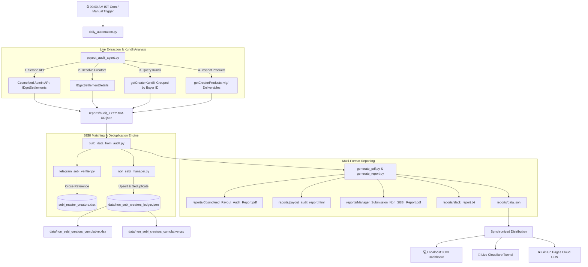

# 🛡️ Cosmofeed Executive Intelligence — Daily Payout Audit & SEBI Compliance

> **Enterprise Compliance Engine, Deduplicated Creator Ledger, and Executive Intelligence Dashboard**  
> Built for monitoring Cosmofeed creator payouts, isolating unauthorized Telegram advisory (`vig/{productId}`), verifying against the official SEBI Master Registry, enforcing a strict 2-day self-transaction rolling window, and maintaining a cumulative non-SEBI creator ledger until **5 September 2026**.

---

## 📌 Table of Contents

1. [🌟 Executive Summary & Mission](#-1-executive-summary--mission)
2. [🛠️ Tech Stack, Languages & Libraries](#-2-tech-stack-languages--libraries)
3. [🔄 End-to-End Workflow Architecture](#-3-end-to-end-workflow-architecture)
4. [🤖 AI Assistant Development & Making Flow](#-4-ai-assistant-development--making-flow)
5. [💻 Step-by-Step Code Snippets & Implementation](#-5-step-by-step-code-snippets--implementation)
6. [📊 Cumulative Non-SEBI Creator Ledger (Until 5 Sep)](#-6-cumulative-non-sebi-creator-ledger-until-5-sep)
7. [🚀 Beginner-Friendly Quick Start Guide](#-7-beginner-friendly-quick-start-guide)
8. [🌐 Live Access & Synchronized URLs](#-8-live-access--synchronized-urls)
9. [📑 Export & Manager Submission Suite](#-9-export--manager-submission-suite)
10. [⏰ Automation & GitHub Actions CI/CD](#-10-automation--github-actions-cicd)

---

## 🌟 1. Executive Summary & Mission

Fintech monetization and creator payment platforms require rigorous compliance controls before funds are released. This system automates compliance auditing across thousands of daily pending settlements:

```
┌───────────────────────────────────────────────────────────────────────────────────┐
│                           CORE COMPLIANCE OBJECTIVES                              │
├───────────────────────────────────────────────────────────────────────────────────┤
│ 1. TELEGRAM & SEBI AUDIT    │ Isolate payouts ≥ ₹1,000 using Telegram channels    │
│                             │ (vig/productId) without verified SEBI registration. │
│ 2. SELF-TRANSACTION WINDOW  │ Isolate creators purchasing their own products.     │
│                             │ Sequenced by Date (Today -> Yesterday -> Buffer).   │
│ 3. PERSISTENT LEDGER        │ Accumulate non-SEBI creators until 05-Sep-2026      │
│                             │ without duplicate entries across daily runs.        │
│ 4. DAILY AUTOMATION         │ Auto-executes before 08:00 AM IST every morning.    │
│ 5. MULTI-CHANNEL SYNC       │ 100% synchronized on Localhost, Tunnel, & Cloud.    │
└───────────────────────────────────────────────────────────────────────────────────┘
```

---

## 🛠️ 2. Tech Stack, Languages & Libraries

The system is engineered using modular, lightweight, and high-performance technologies:

```
┌──────────────────────────┬────────────────────────────────────────────────────────┐
│ Layer                    │ Technology & Libraries Used                            │
├──────────────────────────┼────────────────────────────────────────────────────────┤
│ 🐍 Backend Language      │ Python 3.10 / 3.11 / 3.12                              │
│ ⚡ Concurrency & Pacing  │ concurrent.futures (ThreadPoolExecutor), RatePacer     │
│ 📊 Data & Aggregation    │ pandas (DataFrame, CSV), openpyxl (Multi-Sheet Excel)  │
│ 📑 Document Generation   │ ReportLab (PDF Canvas & Tables), Jinja/HTML5 Templates │
│ 🌐 Local Server          │ Python http.server, urllib.parse (Zero external deps)  │
│ 🎨 Frontend Dashboard    │ HTML5, Vanilla JavaScript (ES6+), Tailwind CSS (CDN)   │
│ 🚀 Tunnel & Proxy        │ Cloudflare Tunnel (cloudflared.exe)                    │
│ 🤖 CI/CD Automation      │ GitHub Actions, Windows Task Scheduler, Batch Scripts  │
└──────────────────────────┴────────────────────────────────────────────────────────┘
```

### Key Libraries & Why They Were Chosen
- **`requests` & `urllib`**: High-throughput authenticated HTTP communication with Cosmofeed Admin APIs.
- **`openpyxl`**: Generates enterprise-ready Excel workbooks (`.xlsx`) with colored header banners, currency formats, borders, and auto-adjusted column widths.
- **`reportlab`**: Builds crisp, publication-grade multi-page PDF documents (`Cosmofeed_Payout_Audit_Report.pdf` and `Manager_Submission_Non_SEBI_Report.pdf`) with formal signature blocks.
- **`concurrent.futures`**: Executes multi-threaded worker pools to audit 2,000+ settlement records in under 2 minutes.
- **`Tailwind CSS`**: Delivers a futuristic, responsive, glassmorphism UI dashboard without complex build steps.

---

## 🔄 3. End-to-End Workflow Architecture



---

## 🤖 4. AI Assistant Development & Making Flow

Here is the systematic lifecycle followed during the engineering and refinement of this platform:

```
┌───────────────────────────────────────────────────────────────────────────────────┐
│                    AI ASSISTANT PROBLEM-SOLVING LIFECYCLE                         │
├───────────────────────────────────────────────────────────────────────────────────┤
│ 1. REQUIREMENT DECONSTRUCTION                                                     │
│    - Identified the 5 core mandates: Telegram vig/ filtering, SEBI master        │
│      matching, 2-day self-transaction sorting, non-repeating creator ledger until │
│      5 Sep, and automated multi-link synchronization before 08:00 AM.              │
│                                                                                   │
│ 2. LIVE SCRAPING & RATE-PACING OPTIMIZATION                                       │
│    - Diagnosed environment token loading in Windows/PowerShell subshells.         │
│    - Engineered `RatePacer(max_per_second=25)` with 16 concurrent worker threads  │
│      to audit 2,000+ settlement records in ~120 seconds with zero HTTP 429 drops. │
│                                                                                   │
│ 3. DEDUPLICATION & RUNNING AGGREGATE LEDGER                                       │
│    - Created `non_sebi_manager.py` using MongoDB 24-character hexadecimal IDs as  │
│      primary keys to eliminate repeated entries across days while computing       │
│      cumulative payout volume held.                                               │
│                                                                                   │
│ 4. DYNAMIC 2-DAY ROLLING WINDOW ENGINE                                            │
│    - Replaced all hardcoded date constants with dynamic date parsers              │
│      (`getTopSelfTxnDays`), automatically adjusting headers and banners for any   │
│      active audit batch (e.g., 01-Sep -> 31-Aug -> 30-Aug).                       │
│                                                                                   │
│ 5. ZERO-ERROR FRONTEND VALIDATION                                                 │
│    - Created simulated headless browser test suites in Node.js to verify that all │
│      table filters, modals, and dynamic badges render without runtime exceptions. │
│                                                                                   │
│ 6. MULTI-LINK DEPLOYMENT & SYNCHRONIZATION                                        │
│    - Ensured identical live metrics on Localhost (:8000), Cloudflare Tunnel,      │
│      and GitHub Pages (Cloud CDN).                                                │
└───────────────────────────────────────────────────────────────────────────────────┘
```

---

## 💻 5. Step-by-Step Code Snippets & Implementation

### Step 1: Live Scraping & Rate Pacing (`payout_audit_agent.py`)
To prevent API throttling when querying thousands of creator endpoints, a token-bucket rate pacer regulates outbound calls:

```python
import time
import threading

class RatePacer:
    """Limits HTTP requests to a safe threshold (e.g., 25 req/sec)."""
    def __init__(self, max_per_second=25):
        self.interval = 1.0 / max_per_second
        self.lock = threading.Lock()
        self.last_time = 0.0

    def pace(self):
        with self.lock:
            now = time.time()
            elapsed = now - self.last_time
            if elapsed < self.interval:
                time.sleep(self.interval - elapsed)
            self.last_time = time.time()

RATE_PACER = RatePacer(max_per_second=25)
```

---

### Step 2: Self-Transaction Detection & Kundli Parsing (`payout_audit_agent.py`)
Inspects buyer transaction history to detect creators who bought their own products:

```python
def check_self_transactions(creator_id, token):
    """Fetches creator's buyer Kundli and isolates self-purchases."""
    url = f"/getCreatorKundli?type=userId&value={creator_id}&requestedAction=groupedByBuyerId"
    data = api_get(url, token)
    
    buyers = extract_kundli_payload(data, "groupedByBuyerId")
    # Flag buyers where selfPayment is True
    self_txns = [b for b in buyers if isinstance(b, dict) and b.get("selfPayment") is True]
    
    return {
        "self": self_txns,
        "buyers": len(buyers)
    }
```

---

### Step 3: Telegram `vig/{productId}` & SEBI Verification (`telegram_sebi_verifier.py`)
Detects Telegram deliverable links and cross-references creator IDs with the official SEBI Master Excel:

```python
def is_telegram_product(product_url="", product_type="", product_id=""):
    """Detects Telegram deliverable links (vig/{productId} or integrated groups)."""
    url_str = str(product_url or "").strip().lower()
    
    # Check for vig/ pattern in URL or product ID
    if "vig/" in url_str or (product_id and f"vig/{product_id.lower()}" in url_str):
        clean_id = extract_product_id(url_str) or product_id
        return True, clean_id, f"https://cosmofeed.com/vig/{clean_id}"
        
    if product_type == "integratedGroup" or "t.me/" in url_str:
        return True, product_id, url_str
        
    return False, "", ""
```

---

### Step 4: Non-SEBI Cumulative Deduplication Ledger (`non_sebi_manager.py`)
Ensures no creator is repeated in stored data, while maintaining a running cumulative total of held payout volume:

```python
def upsert_creator(self, creator_data: dict, audit_date: str):
    """Upserts non-SEBI creator without creating duplicate entries."""
    cid = normalize_creator_id(creator_data.get("creatorId"))
    if not cid:
        return

    payout = float(creator_data.get("payoutAmount") or 0.0)

    if cid not in self.ledger["creators"]:
        # New creator entry
        self.ledger["creators"][cid] = {
            "creatorId": cid,
            "username": creator_data.get("username", ""),
            "firstSeenAuditDate": audit_date,
            "lastSeenAuditDate": audit_date,
            "daysFlaggedCount": 1,
            "datesObserved": [audit_date],
            "cumulativePayoutVolume": payout,
            "complianceHoldStatus": "HOLD - RELEASE RESTRICTED"
        }
    else:
        # Update existing creator without duplicating
        entry = self.ledger["creators"][cid]
        entry["lastSeenAuditDate"] = audit_date
        if audit_date not in entry["datesObserved"]:
            entry["datesObserved"].append(audit_date)
            entry["daysFlaggedCount"] = len(entry["datesObserved"])
            entry["cumulativePayoutVolume"] += payout
```

---

### Step 5: Executive Multi-Page PDF Generation (`generate_pdf.py`)
Generates publication-grade PDF documents using ReportLab:

```python
from reportlab.lib.pagesizes import letter, landscape
from reportlab.platypus import SimpleDocTemplate, Paragraph, Table, TableStyle, Spacer
from reportlab.lib import colors

def generate_pdf_report(output_pdf_path):
    doc = SimpleDocTemplate(output_pdf_path, pagesize=landscape(letter),
                            leftMargin=36, rightMargin=36, topMargin=36, bottomMargin=36)
    story = []
    # Build header, KPI summary table, and creator risk breakdown
    # ...
    doc.build(story)
```

---

### Step 6: Dynamic 2-Day Rolling Window in Frontend (`index.html`)
Dynamically determines the top 3 audit days in the active batch:

```javascript
function getTopSelfTxnDays(creators) {
  const allSelf = (creators || []).filter(c => c.selfTransaction);
  const distinctKeys = [...new Set(allSelf.map(getDayKey))].filter(k => k > 0).sort((a, b) => b - a);
  return distinctKeys.slice(0, 3); // Returns [Today, Yesterday, 2-Day Buffer]
}
```

---

### Step 7: Local Server & Direct Download Endpoints (`server.py`)
Lightweight Python HTTP server supporting all download formats:

```python
from http.server import SimpleHTTPRequestHandler, HTTPServer
import urllib.parse, os, json

class PayoutAuditServer(SimpleHTTPRequestHandler):
    def do_GET(self):
        parsed = urllib.parse.urlparse(self.path)
        if parsed.path == "/api/data":
            # Serve fresh JSON dataset
            return self._serve_file("reports/data.json", "application/json")
        elif parsed.path == "/api/non-sebi/download-excel":
            # Serve cumulative Excel workbook
            return self._serve_download("data/non_sebi_creators_cumulative.xlsx",
                                        "Cosmofeed_Non_SEBI_Cumulative_Ledger_Until_05Sep.xlsx")
        # Handle all remaining endpoints...
```

---

## 📊 6. Cumulative Non-SEBI Creator Ledger (Until 5 Sep)

To fulfill organizational reporting requirements, all non-SEBI creators are tracked until **5 September 2026**:

| Artifact | File Path | Format | Description |
| :--- | :--- | :--- | :--- |
| **JSON Ledger** | [`data/non_sebi_creators_ledger.json`](file:///c:/Users/Mindf/cosmofeed_settlement/data/non_sebi_creators_ledger.json) | JSON | Canonical deduplicated source of truth. |
| **Master Excel** | [`data/non_sebi_creators_cumulative.xlsx`](file:///c:/Users/Mindf/cosmofeed_settlement/data/non_sebi_creators_cumulative.xlsx) | XLSX | Formatted executive workbook with KPI cards and full history. |
| **Master CSV** | [`data/non_sebi_creators_cumulative.csv`](file:///c:/Users/Mindf/cosmofeed_settlement/data/non_sebi_creators_cumulative.csv) | CSV | Flat tabular dataset for BI tools and database ingestion. |
| **Manager Web Report** | [`reports/Manager_Submission_Non_SEBI_Report.html`](file:///c:/Users/Mindf/cosmofeed_settlement/reports/Manager_Submission_Non_SEBI_Report.html) | HTML | Standalone report with executive summary and sign-off blocks. |
| **Manager Formal PDF** | [`reports/Manager_Submission_Non_SEBI_Report.pdf`](file:///c:/Users/Mindf/cosmofeed_settlement/reports/Manager_Submission_Non_SEBI_Report.pdf) | PDF | Landscape PDF report with signature acknowledgement blocks. |

---

## 🚀 7. Beginner-Friendly Quick Start Guide

### Option A: 1-Click Offline Dashboard (Easiest)
On Windows, simply **double-click** the batch file:
```cmd
run_offline_dashboard.bat
```
This automatically starts the local backend server and opens `http://localhost:8000/` in your default browser.

---

### Option B: Running from the Terminal / Command Line
1. **Clone the repository**:
   ```bash
   git clone https://github.com/mohitkr04/cosmofeed_settlement.git
   cd cosmofeed_settlement
   ```

2. **Install Python dependencies**:
   ```bash
   pip install requests pandas openpyxl reportlab
   ```

3. **Start the local dashboard server**:
   ```bash
   python server.py
   ```
   Open `http://localhost:8000/` in your browser.

---

### Option C: Executing Today's Live Settlement Audit Manually
To run today's live audit, update the cumulative non-SEBI ledger, and regenerate all PDF/Excel reports:
```bash
python daily_automation.py
```

---

### Option D: Registering Automatic Daily Windows Task
To schedule the audit to run automatically every day at **09:00 AM IST** without manual intervention:
```powershell
powershell -ExecutionPolicy Bypass -File .\setup_daily_task.ps1
```

---

## 🌐 8. Live Access & Synchronized URLs

The production dashboards are fully synchronized with the daily audit batch:

| Environment | URL | Purpose |
| :--- | :--- | :--- |
| 🌐 **24/7 Cloud Hosted (GitHub Pages)** | **[https://mohitkr04.github.io/cosmofeed_settlement/](https://mohitkr04.github.io/cosmofeed_settlement/)** | Permanent cloud-hosted dashboard. Accessible 24/7 globally with latest daily updates before 08:00 AM IST. |
| 💻 **Offline Localhost** | **[http://localhost:8000/](http://localhost:8000/)** | Fast local HTTP server for offline analysis and direct report access. |

---

## 📑 9. Export & Manager Submission Suite

The dashboard provides 8 instant download options:

```
┌──────────────────────────────────────────────┬──────────────┬───────────────────────────────────────────┐
│ Action / Button                              │ Format       │ Target Audience                           │
├──────────────────────────────────────────────┼──────────────┼───────────────────────────────────────────┤
│ 📑 PDF Report                                │ .pdf         │ Executive Leadership & Finance            │
│ </> HTML Report                              │ .html        │ Operational Teams & Offline Browser View  │
│ 📊 10-Day SEBI Excel                         │ .xlsx        │ Risk Operations & SEBI Cross-Checkers     │
│ 📁 10-Day SEBI CSV                           │ .csv         │ Data Analytics & Warehouse Pipelines      │
│ 👑 Manager Report (5 Sep)                    │ .xlsx / .pdf │ Senior Management Submission (Until 5 Sep)│
│ 💾 Export Filtered CSV                       │ .csv         │ Custom Filtered Search Results            │
│ 💬 Slack Summary                             │ .txt         │ Operations Slack/Teams Daily Briefing     │
└──────────────────────────────────────────────┴──────────────┴───────────────────────────────────────────┘
```

---

## ⏰ 10. 100% Zero-Machine Cloud Autonomy (GitHub Actions)

The system is powered by **100% Zero-Machine, Zero-Human Cloud Autonomy** running on GitHub's Microsoft Cloud data centers. 

> [!NOTE]
> **No Local Machine Required**: You do not need to keep any computer, laptop, or server turned on. Your PC can be completely shut down, sleeping, or you can be traveling on leave. GitHub's cloud runners autonomously wake up, fetch settlements from Cosmofeed, perform compliance and SEBI audits, update all reports, and publish directly to GitHub Pages.

### Autonomous Cloud Cadence:
1. **🌅 Morning Batches (Before 08:00 AM IST)**:
   - **05:30 AM IST** (`0 0 * * *` UTC) — Initial morning batch run
   - **06:30 AM IST** (`0 1 * * *` UTC) — Secondary audit sweep
   - **07:00 AM IST** (`30 1 * * *` UTC) — Verification sweep
   - **07:30 AM IST** (`0 2 * * *` UTC) — Final pre-8:00 AM seal & publish
2. **🔄 Continuous Daytime Updates (Every 2 Hours IST)**:
   - **09:30 AM, 11:30 AM, 01:30 PM, 03:30 PM, 05:30 PM, 07:30 PM, 09:30 PM IST**
   - Automatically ingests newly created settlements submitted throughout the business day.

### Live Access for Colleagues:
Colleagues simply open and refresh:  
👉 **[https://mohitkr04.github.io/cosmofeed_settlement/](https://mohitkr04.github.io/cosmofeed_settlement/)**  
The dashboard utilizes automated cache-busting (`?t=timestamp` and `cache: 'no-store'`) so that every page refresh immediately retrieves the latest live data for that date.

---

*Cosmofeed Compliance Operations · 100% Cloud Autonomous Audit Engine*
